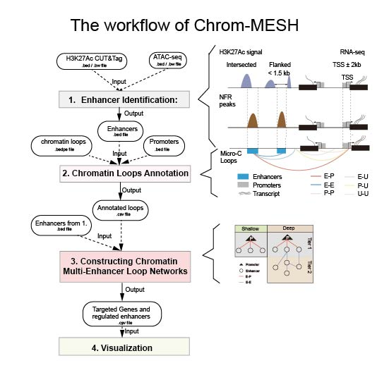

# Chrom-MESH

**Chromatin Multi-scale Enhancer-promoter Spatial Hierarchy**

A comprehensive toolkit for analyzing chromatin multi-enhancer loop networks and gene regulation.

## Features

-   🧬 **Enhancer Identification**: Identify active enhancers from H3K27Ac and ATAC-seq data
-   🔗 **Loop Annotation**: Annotate chromatin loops with enhancer/promoter data
-   📊 **Multi-Enhancer loop Networks**: Construct chromatin multi-enhancer loop networks and Classify genes into deep/shallow regulation categories
-   🎨 **Network Visualization**: Visualize gene regulatory networks

## Workflow



## Python Environment

``` bash
# Create a conda/mamba environment
mamba create -n chrom-mesh python=3.10 -y
mamba activate chrom-mesh

# Or using venv
python -m venv .venv
source .venv/bin/activate   # macOS/Linux
# .venv\Scripts\activate    # Windows PowerShell
```

## Requirements

-   Python: \>=3.10,\<3.13
-   OS: Linux/macOS (Windows via WSL recommended)
-   bedtools \>= 2.30
-   bigWigAverageOverBed (UCSC)
-   bigWigInfo (UCSC)

## Install Chrom-MESH

``` bash
# Clone the repository 
# Estimated time: **~5 minutes** for the full installation workflow.
git clone https://github.com/Leonnnn-thx/Chrom-MESH.git
cd Chrom-MESH
# Aprroximately 5 minutes

# Install the package in development mode
pip install -e .

# Verify installation
python -c "import chrom_mesh; print(chrom_mesh.__version__)"
chrom-mesh --help
python -m chrom_mesh.cli --help
```

## Dependency

``` bash
# Quick check of dependencies
which bedtools
which bigWigAverageOverBed
which bigWigInfo

# If not installed, install via conda/mamba 
mamba install -c bioconda bedtools ucsc-bigwigaverageoverbed ucsc-bigwiginfo -y

# Optional dependencies (for visualization)
pip install matplotlib seaborn
```

## Usage

### Quick Start with Test Data

Before using your own data, we strongly recommend running the test pipeline to understand the complete workflow.

``` bash
# Test for identifying enhancers 

chrom-mesh identify \
  --h3k27ac-bed-dir test_data/identify_enhancer/h3k27ac_bed \
  --h3k27ac-bw-dir  test_data/identify_enhancer/h3k27ac_bw \
  --atac-bed-dir    test_data/identify_enhancer/atac_bed \
  --atac-bw-dir     test_data/identify_enhancer/atac_bw \
  --output test_output/identify_enhancer

# Expected output files in ./test_output/identify_enhancer
# Results of each steps are in ./test_output/identify_enhancer/analysis_summary.txt
```

``` bash
# Test for annotating chromatin loops

chrom-mesh annotate \
  -l test_data/annotate_loops/loops.chr1_1_40000000.bedpe \
  -e test_data/annotate_loops/enhancers.chr1_1_40000000.bed \
  -p test_data/annotate_loops/promoters.chr1_1_40000000.bed \
  -o test_output/annotate_loops/loops.chr1_1_40000000.annotated.csv
  
# Expected output files in ./test_output/annotate_loops
```

``` bash
# Test for constructing chromatin multi-enhancer loop networks

chrom-mesh analyze \
    -l ./test_data/analyze_networks/loops.chr1_1_40000000.annotated.csv \
    -e ./test_data/analyze_networks/enhancers.chr1_1_40000000.bed \
    -o ./test_output/analyze_networks

# Expected output files in ./test_output/analyze_networks/gene_regulatory_depth.csv
```

``` bash
# Test for visualization
chrom-mesh visualize \
  -g ./test_data/visualize/gene_regulatory_depth.csv \
  -l ./test_data/visualize/loops.chr1_1_40000000.annotated.csv \
  -G Tcea1,Rb1cc1 \
  -o ./test_output/visualize/network_Tcea1_Rb1cc1.pdf
# Expected output files in ./test_output/visualize/network_Tcea1_Rb1cc1.pdf
```

## Running on your own data

### **1) Identify active enhancers**

``` bash
chrom-mesh identify \
  --h3k27ac-bed-dir /path/to/h3k27ac_bed \
  --h3k27ac-bw-dir /path/to/h3k27ac_bw \
  --atac-bed-dir /path/to/atac_bed \
  --atac-bw-dir /path/to/atac_bw \
  --output /path/to/output_dir
  
# Expected output 20+ files including final results and process data
# Runtime 20~30 minutes depending on data size 
```

### 2) Annotating chromatin loops using your cis-regulatory elements data

Use enhancer and promoter annotations (or other CREs) to label chromatin loop anchors (obtained from Hi-C/Micro-C/ et. al) and classify loop types.

``` bash
# Input:
#   -l: chromatin loops in BEDPE format
#   -e: enhancer regions in BED format 
#   -p: promoter regions in BED format
# Output:
#   -o: annotated loop table (CSV)

chrom-mesh annotate \
  -l path/to/loop.bedpe \
  -e path/to/enhancer.bed \
  -p path/to/promoter.bed \
  -o path/to/your_annotated_loop.csv
# Expected output file is the path/to/your_annotated_loop.csv
# Runtime: usually under 10 minutes
```

### 3) **Constructing** chromatin multi-enhancer loop networks

Use annotated chromatin loops and enhancer regions to build gene-centered multi-enhancer loop networks.

``` bash
chrom-mesh analyze \
  -l /path/to/annotated_loops.csv \
  -e /path/to/enhancers.bed \
  -o /path/to/output_dir
# -l: annotated loop file (CSV), typically generated by chrom-mesh annotate
# -e: enhancer regions in BED format, typically generated by chrom-mesh identify
# -o: output directory for network analysis results
# Expected results are in path/to/output_dir/gene_regulatory_depth.csv
# Estimated runtime: <10 minutes (typical conditions)
```

### 4) Visualizing chromatin multi-enhancer loop networks

This step generates network figures for selected genes or top10 genes (enhancer numbers) using the regulatory depth table and annotated loop file.

``` bash
chrom-mesh visualize \
  -g /path/to/gene_regulatory_depth.csv \
  -l /path/to/annotated_loops.csv \
  -G GeneA,GeneB \
  -o /path/to/output/network_GeneA_GeneB.pdf

# -g: gene regulatory depth table (CSV), typically from chrom-mesh analyze
# -l: annotated loops file (CSV), typically from chrom-mesh annotate
# -G: comma-separated gene symbols to visualize (no spaces), e.g. Tcea1,Rb1cc1
# -o: output figure path (PDF)

# Expected results: A PDF network plot for the selected genes
# Estimated runtime: <1 minute (dependent on your data)
```

## License

This project is licensed under the MIT License - see the [LICENSE](https://github.com/Badgerliu/EP_annotator/blob/main/LICENSE) file for details.

The MIT License allows for:

-   ✅ Commercial use

-   ✅ Modification

-   ✅ Distribution

-   ✅ Private use

Only requires:

-   📄 License and copyright notice

## Contact

For questions and support, please contact: kq_thx\@163.com

## Development Status

This project is currently under active development.
